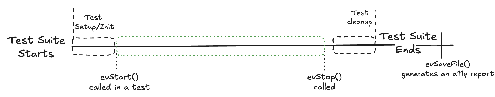
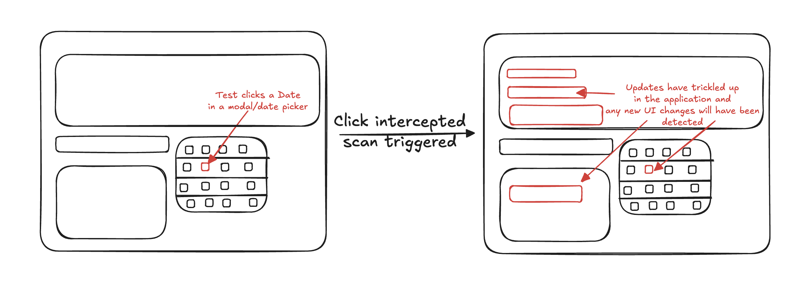

# Continuous Mode
Continuous Mode constantly scans at the start point when it is invoked. Then at the end point, when it is disabled it returns a Report. Typically this Report object is saved as an HTML, CSV, or JSON file.

While the Scanning is enabled, events like clicks or keyboard input will be captured and automatically trigger a re-scan. Lets say for for example you have a date picker and when clicked the new date triggers several updates across the components on the page.

Without continous mode you'd have to know in your tests where this UI change happens, add a method calling for an a11y scan. This is time intensive and error prone.

With Evinced's Continuous Mode you do not have to manually invoke anything! Turn it on at the beginning of the test then turn it off at the end of the test and collect your report. In this scenario the clicking of the date picker triggeres a rescan and any highlighting, new content, changes of colors, etc is automatically captured.

## Enabling the Scan
### Web
Typically the method name is `evStart()`. This is the point in time where the Evinced SDK will start "watching" the browser for changes.

## Ending the Continuous Scanning

### Web
`evStop()` is the method that will halt the scanning and immediately attempt to return a Report. This report is typically best thought of as an array of Accessibility Issues found during the test. Each Issue consists of IDs, Criticality, and other useful pieces of information. Read more in the page about [Reporting](../the-report.md).

{{#include ../snippets/official_docs.md}}
